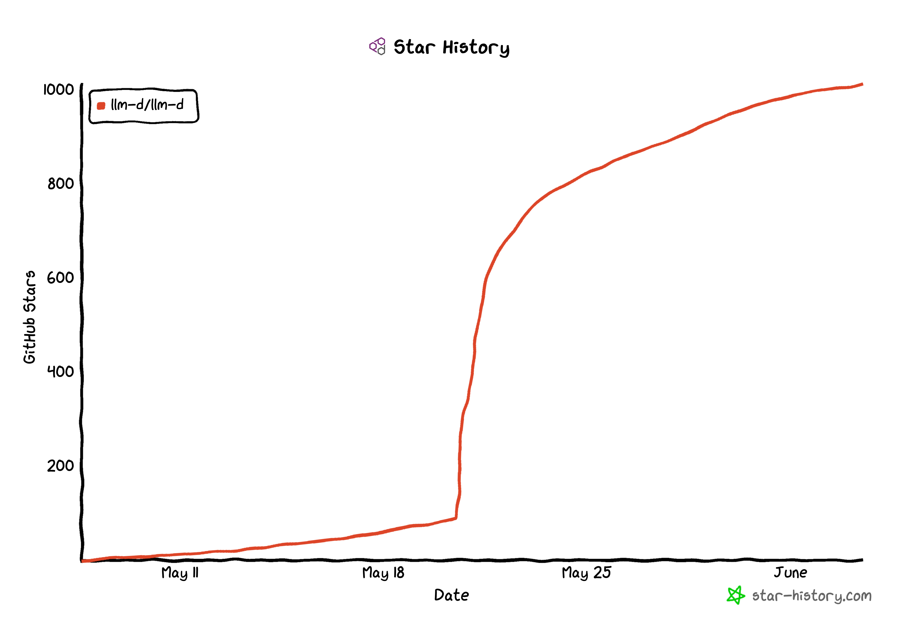

## June 3, 2025

# **llm-d Week 1+2 Project News Round-Up**

 Hey, the llm-d project team has been really busy after the launch on May 20.

We've hit 1000 ⭐️'s on [GitHub](https://github.com/llm-d/llm-d)

<!-- truncate -->

**Here are some of the active design conversations:**

:::tip Join our Google Group
We use Google Groups to share architecture diagrams and other content. Please join: [llm-d-contributors Google Group](https://groups.google.com/g/llm-d-contributors)
:::

* [2025-06-01 \[PUBLIC\] llm-d KVTransfer Protocol](https://docs.google.com/document/d/1zBkToR9XWjvBYLxu15JeoGpq16nH5sFFensZP_3lJQU/view)
* [Revisiting The InferenceModel API](https://docs.google.com/document/d/1x6aI9pbTF5oOsaEQYc9n4pBBY3_AuEY2X51VKxmBSnU/view)
* [ModelService: Declarative Inference Serving on llm-d](https://docs.google.com/document/d/1HA-2yNZpc1F4KhyeYA30shjZpYEDqGIJXqVgDVv3SWU/view)
* [\[External\] Standardizing Large Model Server Metrics in Kubernetes](https://docs.google.com/document/d/1SpSp1E6moa4HSrJnS4x3NpLuj88sMXr2tbofKlzTZpk/view)
* [\[PUBLIC\] LLM Workloads](https://docs.google.com/document/d/1Ia0oRGnkPS8anB4g-_XPGnxfmOTOeqjJNb32Hlo_Tp0)
* [[Public\] LLM-D Inference Scheduler Roadmap](https://docs.google.com/document/d/1Giim_pIGKb4MDue9YFJBlsVkPsWomfVTIFuTmP3PZIo)

**Project links for those wanting to track us or get involved:**

* [Project Launch](https://www.youtube.com/live/Gr8jomztY2s?si=_FT4gGpWGU6MQLyl&t=4994)
* [Contributor Guidelines](https://llm-d.ai/docs/community/contribute)
* [Project Calendar](http://red.ht/llm-d-public-calendar)
    - All SIG meetings
    - Weekly Community Meeting, every Wednesday @ 12:30pm Eastern Time
* Join the [llm-d Google group](http://red.ht/llm-d-google-group) - this is where all engineering drafts are shared. You must join the group to have access to project google docs.
* Join <a href="/slack" target="_self">Slack</a>
* [llm-d Roadmap for Q2](https://github.com/llm-d/llm-d/issues/26)

**Where to follow us on Social Media**

* [https://llm-d.ai](https://llm-d.ai)
* [LinkedIn](http://linkedin.com/company/llm-d)
* [@\_llm\_d\_](https://twitter.com/_llm_d_)
* [r/llm\_d](https://www.reddit.com/r/llm_d/)
* YouTube - coming soon