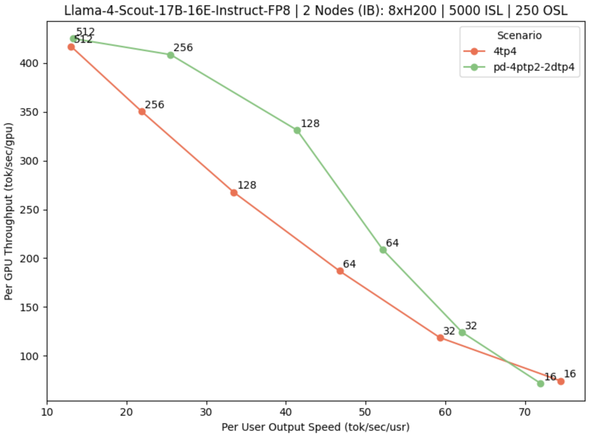

# llm-d 0.2: Our first well-lit paths (mind the tree roots\!)

Our [0.2 release](https://github.com/llm-d/llm-d/releases/tag/v0.2.0) delivers progress against our three well-lit paths to accelerate deploying large scale inference on Kubernetes \- better load balancing, lower latency with disaggregation, and native vLLM support for very large Mixture of Expert models like DeepSeek-R1.

We’ve also enhanced our deployment and benchmarking tooling, incorporating lessons from real-world infrastructure deployments and addressing key antipatterns. This release gives llm-d users, contributors, researchers, and operators, clearer guides for efficient use in tested, reproducible scenarios.

<!-- truncate -->

## New Paths to Production

In this release we've focused on delivering a clear and reproducible set of scenarios that teams can depend on and tested end-to-end on real hardware and models.

Our deployments have been tested and benchmarked on recent GPUs, such as H200 nodes, with models like Llama-3, Llama-4, and DeepSeek-R1. We provide deployment guidance and performance analysis to help teams understand when P/D separation is most beneficial and where tradeoffs emerge.

We’ve defined and improved three well-lit paths that form the foundation of this release:

* [**Intelligent inference scheduling over any vLLM deployment**](https://github.com/llm-d-incubation/llm-d-infra/tree/main/quickstart/examples/inference-scheduling): support for precise prefix-cache aware routing with no additional infrastructure, out-of-the-box load-aware scheduling for better tail latency that “just works”, and a new configurable scheduling profile system enable teams to see immediate latency wins and still customize scheduling behavior for their workloads and infrastructure.  
* [**P/D disaggregation**:](https://github.com/llm-d-incubation/llm-d-infra/tree/main/quickstart/examples/pd-disaggregation) support for separating prefill and decode workloads to improve latency and GPU utilization for long-context scenarios.  
* [**Wide expert parallelism for DeepSeek R1 (EP/DP)**](https://github.com/llm-d-incubation/llm-d-infra/tree/main/quickstart/examples/wide-ep-lws): support for large-scale multi-node deployments using expert and data parallelism patterns for MoE models. This includes optimized deployments leveraging NIXL+UCX for inter-node communication, with fixes and improvements to reduce latency, and demonstrates the use of LeaderWorkerSet for Kubernetes-native inference orchestration.

All of these scenarios are reproducible: we provide reference hardware specs, workloads, and benchmarking harness support, so others can evaluate, reproduce, and extend these benchmarks easily. This also reflects improvements to our deployment tooling and benchmarking framework, a new "machinery" that allows users to set up, test, and analyze these scenarios consistently.

While this is our first release and there are still some rough edges, our goal is to continue to refine and widen these paths to speed adoption. Please [provide feedback](https://github.com/llm-d/llm-d/issues/146) about where to go next\!

## Key enabling changes and technical milestones

llm-d 0.2 builds on the progress of our Special Interest Groups (SIGs), delivering the following key features:

### Modular deployer refactor

We've refactored the deployer into a Helm-first, modular structure, splitting charts for infrastructure, model services, and the inference gateway. These charts are now central to our documentation, complete with clear prerequisites for Kubernetes versions, networking, and GPU hardware. This refactor not only makes it easier for both first-time and advanced users to deploy llm-d but also positions us to work directly with end-user environments where modularity and flexibility adapt ML theory to user production practice.

### P/D disaggregation and DP/EP for MoE deployments

The path for Prefill/Decode (P/D) disaggregation and multi-node DP/EP MoE deployments is now more clearly defined and tested. This work integrates and optimizes key [vLLM 0.10.0](https://github.com/vllm-project/vllm/releases/tag/v0.10.0) kernel improvements, including DeepGEMM and CUTLASS for expert parallel compute, as well as PPLX and DeepEP kernels and intra- and inter-node communication fixes and optimizations and multi-node scenarios. We now include:

* Kubernetes-native deployment recipes now support API servers per DP rank for one-pod-per-rank placement, enhancing scalability and control  
* Helm charts are updated to support LeaderWorkerSet (LWS) for multi-node setups and direct one-pod-per-DP-rank deployments  
* Optimized intra-node communication by enabling DeepEP to use cuda\_ipc efficiently  
* Enhanced NIXL+UCX performance, with fixes and optimizations that significantly reduce inter-node communication overhead, particularly for long context workloads

These validated scenarios are backed by benchmark baselines and example deployments via our quickstarts, offering clearer guidance on what works well today. As part of the "well-lit path" we have also identified limitations including known edge cases around response sizes and failure modes where more work is required.

### Inference scheduler extensibility

The llm-d-inference-scheduler is now far more extensible and aligned with the latest upstream Inference Gateway code base. It’s fully configurable and supports flexible, label selector–based filtering to enable a variety of model server topologies, including LWS-based deployments. We’ve improved the user experience for prefix-aware scheduling by allowing a simple configuration switch between the current estimated prefix tracking at the gateway and a new precise prefix cache–based tracking that reads KV events directly from vLLM for better hit rates.

Our Helm charts now support deployment of scheduler configurations out of the box, making it easier for researchers and operators to iterate on custom scheduling and routing strategies without modifying core components. Internally, testing and development workflows have been updated for improved velocity and quality and this release includes numerous bug fixes.

### Improved benchmarking suite

Our benchmarking suite has matured significantly. It now supports testing any pre-deployed llm-d workload, accommodates multiple load generators, and includes automated analysis and plot generation for easier performance data interpretation.

For this release, we ran sweeps to characterize throughput and scaling to demonstrate the benefits of P/D disaggregation for long context workloads. Scenarios cover representative workload shapes (input/output ratios of 10:1 and 100:1) and explore various parallelism schemes and P/D disaggregation ratios. For each setup, we're measuring throughput scaling (tokens per second per user and tokens per second per GPU) across increasing concurrency levels. These results provide direct comparison with and without P/D separation (just load-aware), highlighting where llm-d’s optimizations deliver significant benefits.

Fig. 1: Pareto curve for Llama-Scout on dual 8×H200 IB nodes, comparing monolithic (4tp4) and P/D-disaggregated (4ptp2–2dtp4) topologies.

The chart above shows the standard Pareto curve for a Llama‑Scout on 2 8xH200 nodes with Infiniband Networking, comparing standard 4tp4 topology to a disaggregated 4ptp2-2dtp4 configuration (maintaining the total GPU count). The X-axis measures the latency observed by each user and the Y-axis measures the total throughput per GPU. Each point on the chart represents a particular concurrency.

While both configurations perform similarly at very low or very high user output speeds, the disaggregated setup delivers significantly higher per-GPU throughput at medium concurrency levels (particularly around 64-128 concurrent requests), where contention between prefill and decode phases tend to dominate. This validates that disaggregation doesn’t just increase throughput, it exposes saturation points and unlocks headroom that is otherwise lost to phase interference. These insights are critical to autoscaling, role assignment, and future predictor-driven and SLO-aware scheduling.

These results follow a broader trend previously reported \[[1](https://developer.nvidia.com/blog/how-nvidia-gb200-nvl72-and-nvidia-dynamo-boost-inference-performance-for-moe-models/), [2](https://arxiv.org/abs/2506.05508)\]: disaggregated serving consistently provides the greatest benefit under medium‑concurrency conditions, particularly for prefill‑heavy traffic and larger models. Our results confirm this trend, showing improved throughput and clearer saturation dynamics at mid‑throughput, strongly validating our architectural direction. By decoupling prefill and decode phases, we not only boost raw performance but also surface scaling limits that static, monolithic systems obscure. This lays the foundation for dynamic topology adaptation, predictor‑informed routing, and autoscaling strategies driven by the real‑time behavior of workloads. These are key priorities for our upcoming releases.

### Image improvements

Multi-arch support, smaller images, and hardened configurations ensure a reliable out-of-the-box experience.

## What we've learned and sharing with the community

Here are some key lessons we learned so far in our progress with llm-d:

* **Low-hanging fruit matters.** Targeted optimizations, like reducing KV‑cache transfer overhead between prefill and decode workers and refining prefix‑aware scheduling, delivered significant gains in throughput and tail latency. These quick wins required minimal change but paved the way for the deeper architectural improvements planned in upcoming releases.  
* **Using bleeding-edge libraries is hard.** Many key libraries associated with distributed inference are immature. Through our applied experiments in our well-lit paths and in close collaboration with ecosystem partners, we have improved much of the key infrastructure the larger community relies on in real-world conditions.  
* **Build on proven paths.** This validates why llm-d exists: to help users avoid discovering these problems themselves, offering reproducible deployments, performance baselines, and extensibility. llm-d focuses on building these paths so our users don’t need to troubleshoot these complex challenges in isolation.  
* **Community matters.** Working closely with the NVIDIA Dynamo community, we've tackled NIXL/UCX performance overheads for long context workloads, leading to significant improvements and active upstream contributions.

### Our survey

In our first [community survey,](https://llm-d.ai/blog/llm-d-community-update-june-2025) we invited users to share their deployment requirements and challenges to help shape the future of the llm-d project and better understand how teams are serving LLMs today. We heard from a broad and diverse group, from platform engineers, business leaders, and data practitioners, reflecting a wide range of workloads, architectures, and operational maturity.

Conversational AI (82.9%) and real-time applications (56.1%) stood out as the most common workloads, with nearly half of respondents supporting 4-10 models concurrently. Hardware choices highlight a diverse landscape: 85% use NVIDIA GPUs, 29% run AMD GPUs, and 27% deploy on CPUs alone, a surprising signal. Model preferences show Llama (73%), Qwen (63%), and Mistral (56%) leading the way. Yet despite this activity, SLO maturity is still emerging: 46% report no formal SLOs, and 39% are still defining theirs, suggesting many teams are in exploratory or early production phases. What came through clearly is strong demand for operational features like routing, caching, observability, and flexibility, signaling that ease of use and manageability are top priorities as teams scale. See a full summary of [the survey responses here](https://docs.google.com/document/d/1vwcIsCxrql0yObBEf-ziEThHIWAw8cY0FG68iGt3sj8).

## What you get today

Today, [llm-d 0.2](https://github.com/llm-d/llm-d/releases/tag/v0.2.0) offers:

* Modular Helm charts and clear deployment workflows.  
* Verified support for P/D, DP/EP, pod-per-rank, and heterogeneous GPUs (H200, B200).  
* Reproducible performance baselines, now with MoE support.  
* New foundations for routing and scheduler extensibility.  
* A developer, and researcher-friendly platform with tested examples, with detailed guides on the way.

## A growing community

The best part of llm-d has been watching the community grow around it. We're thrilled that over 700 people have already joined our Slack channel, and the project has been starred over 1,400 times on GitHub. This isn't just about numbers; it’s about the active, collaborative spirit that drives the project forward.

Much of the work happens within our seven Special Interest Groups (SIGs), each focused on a key area:

* **Inference Scheduler** – Developing smarter routing and load‑balancing strategies, including KV‑cache‑aware scheduling.  
* **P/D Disaggregation** – Advancing phase‑separation strategies to improve resource‑utilization efficiency.  
* **KV Disaggregation** – Advancing and optimizing distributed KV‑cache management.  
* **Installation** – Streamlining deployment on Kubernetes, from single‑node setups to large multi‑node clusters.  
* **Benchmarking** – Building tools to automate performance validation and make scenarios easier to reproduce and extend.  
* **Autoscaling** – Adapting resources dynamically based on workload demands.  
* **Observability** – Providing deep visibility into system performance and health.

We're also collaborating with other great open-source communities like vLLM, Dynamo, and LMCache. Every one of these groups is open, and we’d love for you to join in. Whether you want to contribute code, share ideas, or just listen in, you are welcome. You can find details for each SIG, including their leaders and meeting times, on [our community page](https://llm-d.ai/docs/community/sigs).

## What's next: 

Looking ahead, our community is focusing on these key areas:

* **Core optimizations**  
  * TCP-based request dispatch upstream  
  * Disaggregation protocol refinements, including possible sidecar removal  
  * CPU cache offloading to expand memory capacity  
  * KV event awareness baked directly into routing decisions  
  * SLO-driven scheduling architecture for predictable performance  
* **Benchmarking enhancements:**  
  * Expanded reproducibility guides.  
  * Complete performance validation for core scenarios.  
* **Developer experience improvements:**  
  * Expanded examples for inference gateway and scheduler extensibility.  
  * Central Helm charts and expanded documentation.

See our [roadmap issue](https://github.com/llm-d/llm-d/issues/146) to see what is coming next and make your voice heard\!

## **Join the llm-d community\!**

We welcome researchers exploring scheduling, autoscaling, and routing optimization challenges. Your contributions are invaluable\!

Community engagement is key to our success:

* [**Join our community calls**](https://red.ht/llm-d-public-calendar) (Wed 12:30pm ET)

Contribute on [GitHub](https://github.com/llm-d), join our community calls, join the SIGs and build with us\!
