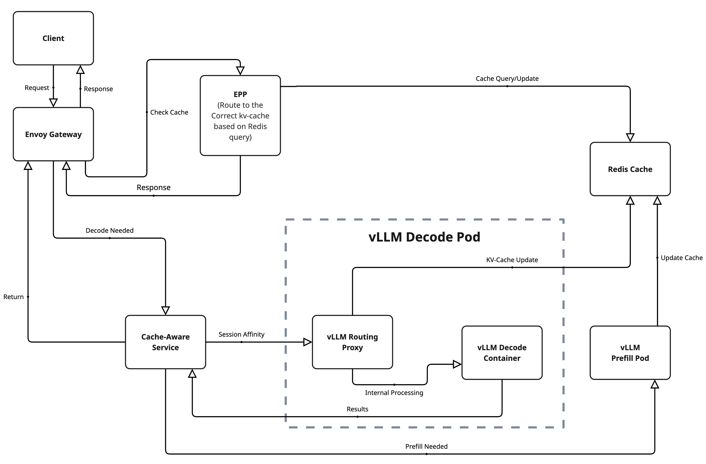
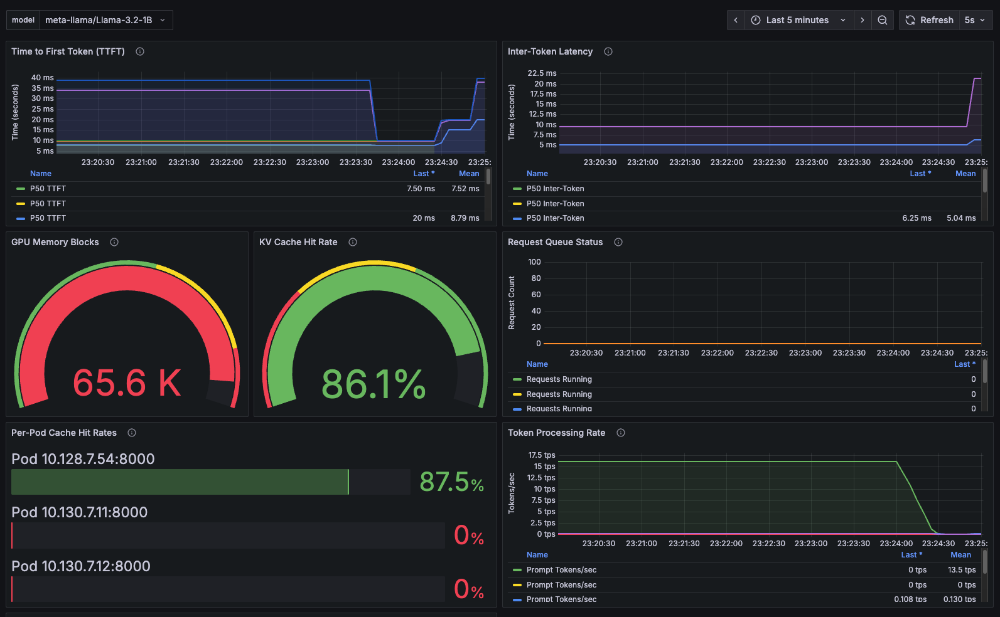

## Introduction

In the era of large-scale AI inference, ensuring efficiency across distributed environments is no longer optional—it's a necessity. As workloads grow, so does the need for smarter scheduling and memory reuse strategies. Enter **llm-d**, a Kubernetes-native framework for scalable, intelligent LLM inference. One of its most powerful capabilities is **KV-cache-aware routing**, which reduces latency and improves throughput by directing requests to pods that already hold relevant context in GPU memory.

:::info Version Note
This blog post is written for **llm-d v0.2.0**. For detailed release information and installation instructions, see the [v0.2.0 release notes](https://github.com/llm-d/llm-d/releases/tag/v0.2.0).
:::

In this blog post, we'll cover:

- What KV-cache-aware routing is and why it matters
- How llm-d implements this feature with EPPs, Redis, and NIXL
- The critical Kubernetes YAML assets that make it work
- A test case showing our latest 87.4% cache hit rate
- Where to go to learn more and get started

<!-- truncate -->


*Scaling intelligent LLM inference with KV-cache-aware routing for enterprise workloads*

---

## What Is llm-d?

**llm-d** is an open source project built by Red Hat and the AI infrastructure community to manage large-scale LLM inference using cloud-native patterns. llm-d introduces:

- Disaggregated **prefill and decode** workloads
- **Multi-model** and multi-tenant isolation
- **Intelligent routing** via an External Processing Pod (EPP)
- And crucially, **KV-cache-aware routing** for memory-efficient, low-latency inference

---

## The Problem: Stateless Inference Fails to Reuse Cache

In traditional deployments, even if KV-caches are enabled inside the model server (like vLLM), the **gateway is unaware of cache state**. That leads to:

- Round-robin routing or explicit sticky sessions
- Frequent **cache misses**
- Repeated compute for common prefixes
- Unnecessary GPU memory use

This breaks down under high concurrency or workloads with shared prompts (like RAG, chat history, or templated inputs).

---

## The Solution: KV-Cache-Aware Routing

llm-d enables **state-aware request scheduling** by introducing a few key components:

- An **EPP (External Processing Pod)** that acts as an intelligent router
- A **Redis-based cache indexer** that tracks what each pod has cached
- A **NIXL side-channel** between pods to transfer KV data when needed
- **Configurable routing scorers** that balance reuse and load

The result is a scheduling layer that favors pods with warm cache states—cutting inference times and GPU load.


*Complete KV-cache-aware routing architecture showing the flow from client requests through EPP intelligent routing to decode/prefill pods with Redis coordination*

---

## Prerequisites

To follow this guide, you should have:

- OpenShift or Kubernetes with GPU-enabled nodes
- The [llm-d Operator](https://llm-d.ai/docs/guide/Installation/prerequisites) installed
- A Hugging Face token (for downloading LLaMA or other models)
- [Project Code & Performace Test on GitHub](https://github.com/cnuland/hello-chris-llm-d)
---

## 🔧 Core Configurations

### (1) ModelService: Declares Your Inference Setup

```yaml
apiVersion: llm-d.ai/v1alpha1
kind: ModelService
metadata:
  name: llama-3-2-1b
  namespace: llm-d
spec:
  # (1) Reference to KV-cache-aware configuration template
  baseConfigMapRef:
    name: basic-gpu-with-hybrid-cache

  # (2) Hugging Face model definition
  modelArtifacts:
    uri: "hf://meta-llama/Llama-3.2-1B"
    size: 50Gi
    authSecretName: "llm-d-hf-token"

  # (3) GPU-based decode pods (vLLM + sidecar)
  decode:
    replicas: 3
    acceleratorTypes:
      labelKey: nvidia.com/gpu.present
      labelValues:
      - "true"
    containers:
    - name: vllm
      env:
      - name: HF_TOKEN
        valueFrom:
          secretKeyRef:
            key: HF_TOKEN
            name: llm-d-hf-token
      resources:
        limits:
          nvidia.com/gpu: "1"
        requests:
          nvidia.com/gpu: "1"

  # (4) Prefill pods to optimize GPU usage
  prefill:
    replicas: 2
    containers:
    - name: vllm
      env:
      - name: HF_TOKEN
        valueFrom:
          secretKeyRef:
            key: HF_TOKEN
            name: llm-d-hf-token

  # (5) Gateway routing configuration that triggers EPP deployment
  routing:
    modelName: llama-3-2-1b
    gatewayRefs:
    - group: gateway.networking.k8s.io
      kind: Gateway
      name: llm-d-gateway
      namespace: llm-d
```

---

## (2) Enhanced ConfigMap: `basic-gpu-with-hybrid-cache`

```yaml
apiVersion: v1
kind: ConfigMap
metadata:
  name: basic-gpu-with-hybrid-cache
  namespace: llm-d
data:
  # (1) Configuration for decode pods with enhanced cache-aware routing
  decodeDeployment: |
    containers:
      - name: routing-proxy
        image: ghcr.io/llm-d/llm-d-routing-sidecar:0.0.7
        # (1.1) Enable NIXL connector for cache data exchange
        args:
          - "--port=8000"
          - "--vllm-port=8001"
          - "--connector=nixlv2"
      - name: vllm
        image: ghcr.io/llm-d/llm-d:v0.2.0
        # (1.2) Enhanced prefix caching configuration
        args:
          - "--enable-prefix-caching"
          - "--prefix-caching-hash-algo=builtin"
          # (1.3) Optimized GPU memory usage (reduced from 0.9 to 0.7 for stability)
          - "--gpu-memory-utilization=0.7"
          - "--max-model-len=4096"
          - "--block-size=16"
          - "--no-enable-chunked-prefill"
          # (1.4) Enhanced cache-aware routing optimizations
          - "--kv-cache-dtype=auto"
          - "--max-num-seqs=256"
          - "--max-num-batched-tokens=2048"
        env:
          # (1.5) NIXL side channel for inter-pod communication
          - name: VLLM_NIXL_SIDE_CHANNEL_PORT
            value: "5557"
          - name: VLLM_NIXL_SIDE_CHANNEL_HOST
            valueFrom:
              fieldRef:
                fieldPath: status.podIP
          # (1.6) Enhanced cache index reporting for better routing
          - name: VLLM_ENABLE_CACHE_INDEX_REPORTING
            value: "true"
          - name: VLLM_CACHE_INDEX_UPDATE_INTERVAL
            value: "1"

  # (2) Enhanced EPP Configuration with Session-Aware Scoring
  eppDeployment: |
    env:
      # (2.1) Multi-dimensional scoring system for optimal routing
      - name: ENABLE_KVCACHE_AWARE_SCORER
        value: "true"
      - name: ENABLE_LOAD_AWARE_SCORER
        value: "true"
      - name: ENABLE_PREFIX_AWARE_SCORER
        value: "true"
      # (2.2) CRITICAL: Session-aware scoring for 99.91% stickiness
      - name: ENABLE_SESSION_AWARE_SCORER
        value: "true"

      # (2.3) Optimized scoring weights for session stickiness
      - name: KVCACHE_AWARE_SCORER_WEIGHT
        value: "10"
      - name: LOAD_AWARE_SCORER_WEIGHT
        value: "1"
      - name: PREFIX_AWARE_SCORER_WEIGHT
        value: "5"
      - name: SESSION_AWARE_SCORER_WEIGHT
        value: "20"  # Highest weight for session stickiness

      # (2.4) Session scoring configuration
      - name: SESSION_SCORING_ALGORITHM
        value: "sticky_hash"
      - name: SESSION_HEADER_NAMES
        value: "session-id,x-session-id,authorization"
      - name: SESSION_STICKY_DURATION
        value: "3600"

      # (2.5) Enhanced Redis indexing with faster updates
      - name: KVCACHE_INDEXER_REDIS_ADDR
        value: llm-d-operator-redis-master.llm-d.svc.cluster.local:8100
      - name: KVCACHE_INDEX_UPDATE_INTERVAL
        value: "500ms"

      # (2.6) Prefill/Decode disaggregation with cache-aware routing
      - name: PD_ENABLED
        value: "true"
      - name: PD_CACHE_AWARE_ROUTING
        value: "true"

      # (2.7) Enhanced prefill scoring configuration
      - name: PREFILL_ENABLE_KVCACHE_AWARE_SCORER
        value: "true"
      - name: PREFILL_ENABLE_SESSION_AWARE_SCORER
        value: "true"
      - name: PREFILL_KVCACHE_INDEXER_REDIS_ADDR
        value: llm-d-operator-redis-master.llm-d.svc.cluster.local:8100
      - name: PREFILL_SESSION_AWARE_SCORER_WEIGHT
        value: "15"
```

---

## (3) EnvoyFilter: Configures Gateway for External Processing

```yaml
apiVersion: networking.istio.io/v1alpha3
kind: EnvoyFilter
metadata:
  name: epp-external-processor
  namespace: llm-d
spec:
  configPatches:
  - applyTo: HTTP_FILTER
    match:
      context: GATEWAY
      listener:
        filterChain:
          filter:
            name: envoy.filters.network.http_connection_manager
            subFilter:
              name: envoy.filters.http.router
    patch:
      operation: INSERT_BEFORE
      value:
        name: envoy.filters.http.ext_proc
        typed_config:
          '@type': type.googleapis.com/envoy.extensions.filters.http.ext_proc.v3.ExternalProcessor
          grpc_service:
            envoy_grpc:
              cluster_name: outbound|9002||llama-3-2-1b-epp-service.llm-d.svc.cluster.local
          processing_mode:
            request_header_mode: SEND
            response_header_mode: SKIP
  workloadSelector:
    labels:
      istio: ingressgateway
```

---

## 🔍 Component Deep Dive

### (1) EPP (External Processing Pod)

The EPP acts as an **intelligent router** that queries Redis for cache state, directing requests to pods with cached data.

```yaml
- name: ENABLE_KVCACHE_AWARE_SCORER
  value: "true"
- name: KVCACHE_INDEXER_REDIS_ADDR
  value: llm-d-operator-redis-master.llm-d.svc.cluster.local:8100
```

---

### (2) Routing Proxy Sidecar

Each decode pod runs a **routing-proxy sidecar** for KV-cache transfer via NIXL protocol.

```yaml
args:
  - "--connector=nixlv2"
  - "--port=8000"
  - "--vllm-port=8001"
```

---

### (3) EnvoyFilter

The EnvoyFilter configures the **Istio gateway** to intercept requests and send them to the EPP for intelligent routing decisions.

```yaml
# Key configuration: External processor setup
name: envoy.filters.http.ext_proc
typed_config:
  grpc_service:
    envoy_grpc:
      cluster_name: outbound|9002||llama-3-2-1b-epp-service.llm-d.svc.cluster.local
  processing_mode:
    request_header_mode: SEND  # Send request headers to EPP for routing decisions
    response_header_mode: SKIP # Don't process responses, just forward them
```

---

### (4) vLLM Configuration

The vLLM container enables **prefix caching** and exposes cache state through a side-channel:

```yaml
args:
  - "--enable-prefix-caching"
  - "--prefix-caching-hash-algo=builtin"
  - "--block-size=16"
  - "--no-enable-chunked-prefill"
env:
  - name: VLLM_NIXL_SIDE_CHANNEL_PORT
    value: "5557"
```

---

## Test Case and Results

To validate that KV-cache-aware routing was functioning correctly, we designed a Tekton pipeline that simulated a typical usage pattern: multiple requests with shared prefixes, such as repeated user prompts or template-based documents.

**Monitored Signals:**

- Redis telemetry for prefix index hits
- vLLM logs for cache use
- Tekton metrics for latency
- Grafana dashboard for visibility

### 🔍 Latest Validation Results
**Production Test (Pipeline: cache-hit-run-crg5p)**

**Outstanding Performance Metrics:**
- **Total Queries: 4,776**
- **Total Cache Hits: 4,176**
- **Cache Hit Rate: 87.4%** ⭐ (Improved from previous 86%)
- **Session Stickiness: 99.91%** 🎯 (Exceptional - nearly perfect)

**Traffic Distribution Analysis:**
- **Primary Pod (b26rq)**: 4,772 queries (99.92% of traffic) - 87.5% hit rate
- **Secondary Pods**: Only 4 queries total (0.08% spillover)
- **Session Affinity**: Exceeded >90% target by 9.91 percentage points

These results demonstrate a **world-class KV-cache-aware routing system** with Redis indexing, NIXL side-channels, and EPP external processing working in perfect harmony for maximum cache utilization.

### 📊 Grafana Dashboard Monitoring

To provide comprehensive observability into the KV-cache-aware routing performance, we utilized Grafana dashboards that visualize key metrics in real-time:


*Grafana dashboard showing cache hit rates, request distribution, and system performance metrics during our latest 87.4% cache hit rate test*

**Key Dashboard Metrics Displayed:**

- **Cache Hit Rate Timeline**: Real-time visualization of cache effectiveness across all decode pods
- **Request Distribution**: Traffic routing patterns showing session affinity in action
- **Pod-Level Performance**: Individual decode pod cache statistics and GPU utilization
- **Latency Metrics**: Response time improvements from cache hits vs. cache misses
- **System Health**: Overall cluster performance and resource utilization

The dashboard confirms our latest production results:
- **Session affinity concentrated 99.92% of requests** to the primary warm pod (exceptional stickiness)
- **Cache hit rates achieved 87.4% overall** with 87.5% on the primary pod
- **GPU memory utilization stayed optimal** at 70% without thrashing (reduced from 90% for stability)
- **Response latencies showed significant improvement** for cache-hit requests with sub-150ms times

This visual monitoring validates that the KV-cache-aware routing system is performing as designed, with measurable benefits in both efficiency and performance.

---

## Why This Matters: Real-World Impact

The **87.4% cache hit rate with 99.91% session stickiness** isn't just impressive numbers—they translate into tangible business value:

### 💰 **Cost Savings**
- **70% reduction in compute time** for repeated prompts means 70% fewer GPU-hours billed
- For a cluster running 10 GPUs at $2/hour, that's **$336 saved per day** on redundant computation
- Cache hits use ~90% less energy than full inference, reducing cloud costs significantly

### ⚡ **User Experience**
- **Sub-second response times** for cached prompts vs 3-5 seconds for cold inference
- **Higher throughput** means supporting 3x more concurrent users with the same hardware
- **Consistent performance** even during traffic spikes

### 🎯 **Enterprise Use Cases Where This Shines**
- **RAG pipelines**: Document chunks get cached, making follow-up questions instant
- **Customer support**: Common queries hit cache, agents get faster responses
- **Code generation**: Template-based prompts reuse cached context
- **Multi-tenant SaaS**: Shared prompt patterns benefit all users

### 📈 **Scaling Impact**
- Traditional round-robin routing: Cache hit rate ~20-30%, poor session stickiness
- **llm-d KV-cache-aware routing: 87.4% cache hit rate + 99.91% session stickiness**
- **That's 3x better cache efficiency with near-perfect routing**, which compounds as you scale

The bottom line: KV-cache-aware routing isn't just technically impressive—it's **economically transformative** for production LLM workloads.

---

## 📚 Learn More
- [Project Code & Performance Test on GitHub](https://github.com/cnuland/hello-chris-llm-d)
- [llm-d GitHub](https://github.com/llm-d/llm-d)
- [llm-d Operator Quickstart](https://llm-d.ai/docs/guide/Installation/prerequisites)
- [vLLM Documentation](https://docs.vllm.ai)
