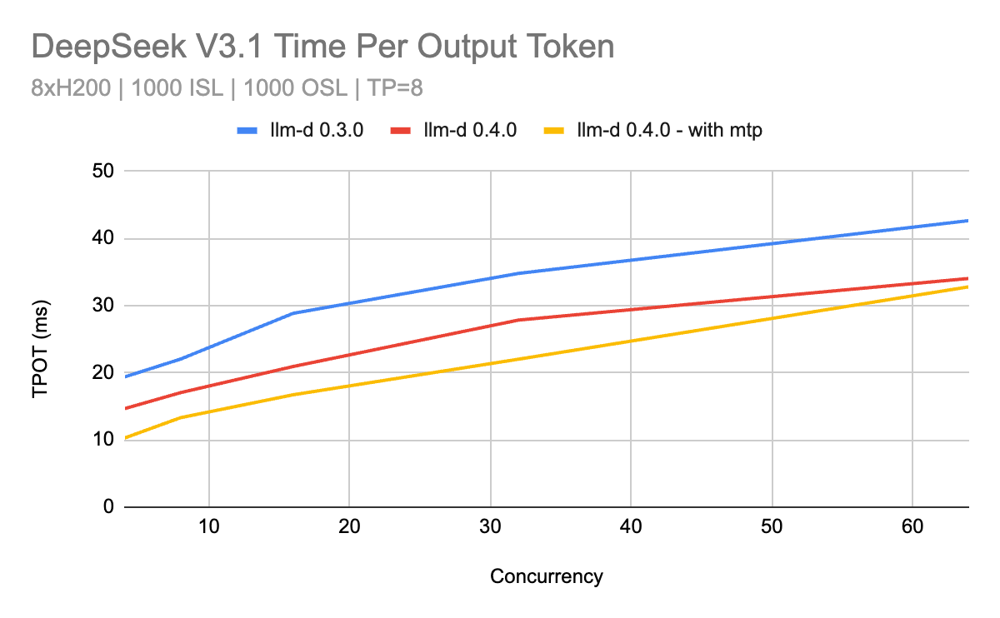
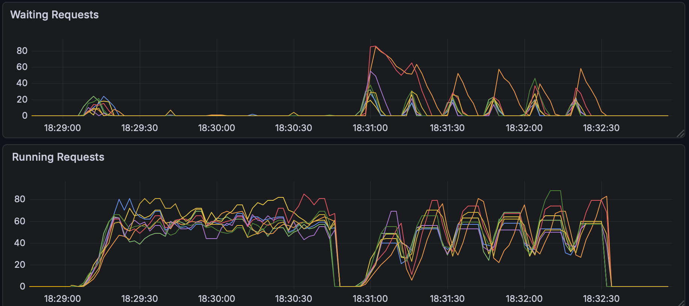
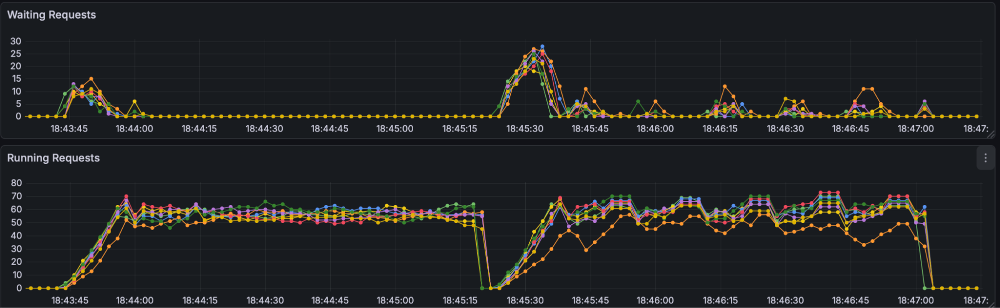

# llm-d 0.4: Achieve SOTA Performance Across Accelerators

llm-d’s mission is to provide the fastest time to SOTA inference performance across any accelerator and cloud. In our [0.3 release](https://llm-d.ai/blog/llm-d-v0.3-expanded-hardware-faster-perf-and-igw-ga) we enabled wide expert parallelism for large mixture-of-expert models to provide extremely high output token throughput \- a key enabler for reinforcement learning \- and we added preliminary support for multiple non-GPU accelerator families.

This release brings the complement to expert parallelism throughput: **improving end-to-end request latency of production serving**. We reduce DeepSeek per token latency up to 50% with speculative decoding and vLLM optimizations for latency critical workloads. We add dynamic disaggregated serving support to Google TPU and Intel XPU to further reduce time to first token latency when traffic is unpredictable, while our new well-lit path for prefix cache offloading helps you leverage CPU memory and high performance remote storage to increase hit rates and reduce tail latency. For users with multiple model deployments our workload autoscaler preview takes real-time server capacity and traffic into account to reduce the amount of time a model deployment is queuing requests \- lessening the operational toil running multiple models over constrained accelerator capacity.

These OSS inference stack optimizations, surfaced through our [well-lit paths](https://github.com/llm-d/llm-d/blob/main/guides/README.md#well-lit-path-guides), ensure you reach SOTA latency on frontier OSS models in real world scenarios.

<!-- truncate -->

## SOTA Low Latency Serving on Large MoE

While our previous releases focused on throughput, v0.4 delivers the features necessary to guarantee ultra-low latency, particularly for demanding wide EP MoE models.

We integrated critical low-latency optimizations for MoE models in vLLM and observed an over 40% reduction of per token latency for DeepSeek V3.1 on H200 GPUs:

* **Speculative decoding** leverages under utilized compute at low concurrency to run a smaller “draft” model and guesses at the next valid token \- correct guesses are cheaper to validate and thus reduce per output token latency.  We also tested and improved a number of MoE specific optimizations, including DeepSeek’s native MTP support.  We launched the [speculators OSS project](https://github.com/vllm-project/speculators) to broaden support for speculative decoding among popular models and are continuously adding new architectures to our [Hugging Face Hub](https://huggingface.co/collections/RedHatAI/speculator-models).  
* **Async Scheduling:** integration of asynchronous scheduling in vLLM allows for more efficient overlapping of compute and CPU scheduling operations, ensuring that the system can sustain high request rates while maintaining low latencies.  
* **Block-FP8 kernel optimizations** to fuse key elementwise operations, overlap shared expert computation with grouped expert routing, and select more efficient kernels

The recommendations and tradeoffs in tuning for latency will become a well-lit path in the next release of llm-d.

## Expanding Hardware Choice

The community has [continued to integrate support across a diverse range of accelerators](https://github.com/llm-d/llm-d/tree/main/docs/accelerators#support) and [providers](https://github.com/llm-d/llm-d/tree/main/docs/infra-providers), making llm-d the definitive hardware-agnostic control plane:

* **Google TPU Disaggregation over DCN:** We integrate the latest vLLM \+ TPU architecture with our [dynamic disaggregation recipe for llama3-70b](https://github.com/llm-d/llm-d/blob/main/guides/pd-disaggregation/README.tpu.md), allowing high performance KV cache transfer over datacenter TCP and allowing on-demand scaling of prefill instances in response to prefill load.  
* **Intel XPU Integration:** [Initial support](https://github.com/llm-d/llm-d/tree/main/docs/accelerators#intel-xpu) and verification for the intelligent scheduling and disaggregation well-lit paths.  
* **AWS EFA Support:** Support for AWS Elastic Fabric Adapters (EFA) has been added to the llm-d CUDA image in the form of NIXL libfabric libraries to enable low-latency communication on AWS accelerator clusters with [full EFA support in a future release](https://github.com/llm-d/llm-d/issues/522).

## Expanding the well-lit paths

### **New well-lit path for prefix cache offloading**

For long-context or high-concurrency multi-turn workloads, GPU memory is the bottleneck. To address this, we are recommending [**tiered prefix-cache offloading**](https://github.com/llm-d/llm-d/blob/main/guides/tiered-prefix-cache/README.md) as a standard practice in llm-d v0.4.

We have formalized [vLLM-native CPU offloading](https://github.com/vllm-project/vllm/issues/19854) and [LMCache](https://lmcache.ai/) connectors under a new well-lit path that allows the system to transparently utilize host CPU RAM \- which is often underutilized \- as a secondary storage tier for the KV cache. Instead of dropping context when VRAM fills up, llm-d allows you to swap blocks to the CPU and retrieve them when needed.

In our [user guide benchmarking](https://github.com/llm-d/llm-d/blob/main/guides/tiered-prefix-cache/cpu/README.md#benchmark), enabling CPU offloading when KV cache working set exceeded the available HBM capacity yielded a **25% reduction in mean Time To First Token (TTFT)** and a **21% increase in total throughput**.

| HBM < KVCache < HBM + CPU RAM | Mean TTFT (second) | P90 TTFT (second) | Mean E2E Latency (second) | P90 E2E Latency (second) | Overall Throughput (token per second) |
| :--- | :--- | :--- | :--- | :--- | :--- |
| **Baseline vLLM** | 9.0 | 20.9 | 37.8 | 49.7 | 38534.8 |
| **vLLM + CPU offloading 100GB** | 6.7 (-25.6%) | 20.2 (-3.3%) | 30.9 (-18.3%) | 44.2 (-11.1%) | 46751.0 (+21.3%) |
| **vLLM + LMCache CPU offloading 100GB** | 6.5 (-27.8%) | 18.8 (-10.0%) | 30.8 (-18.5%) | 43.0 (-13.5%) | 46910.6 (+21.7%) |

[*Table: High Performance*](https://github.com/llm-d/llm-d/blob/main/guides/tiered-prefix-cache/cpu/README.md#high-cache-performance) *compares the performance of the baseline vLLM with the vLLM using the CPU offloading connector when the KVCache size is larger than the available HBM.)*

By treating CPU memory as an active extension of the GPU, operators can run larger models or higher concurrency on existing hardware, **significantly improving token-per-dollar value**. This sets the stage for deeper tiering strategies, including upcoming guides on distributed storage offloading.

### **Enhanced intelligent scheduling**

To complement the new offloading capabilities, we have updated our **intelligent inference scheduling** well-lit path to fully leverage the tiered memory architecture.

* **Tier-aware precision:** Prefix-cache affinity now accounts for the cost dynamics of the new cache tier. We implemented granular KV-cache tracking with **configurable weighted scoring** (e.g., weighting GPU hits higher than CPU hits). This allows the router to calculate the most efficient path for KV retrieval, balancing the high value of GPU-resident data against the available capacity of the CPU tier.

Drawing on extensive benchmarking data, we also refined our **load-oriented distribution** scorers, highlighting:

* **Saturation stability:** we introduced the `no-hit-lru-scorer`. This scorer intelligently distributes "cold" requests \- the seeds that form new prefix-cache trails \- to prevent hotspots during cache formation. This eliminates oscillating wait-queues, allowing the cluster to **maintain stability at higher concurrency on the same hardware** for workloads with prefix reuse opportunities.

For workloads with **prefix-reuse opportunities**, this improved placement logic **cut P99 Time To First Token (TTFT) in half** (18.3s \-\> 8s) while maintaining stability at peak concurrency.

Benchmark comparison: Running 8x Qwen-32B on 16 NVIDIA H100 GPUs at 50 QPS with **5500:1000 ISL/OSL requests** sharing **150 unique prefixes**. The v0.4 scheduler (bottom) eliminates the wait-queue oscillations seen in v0.3, resulting in a 50% reduction in P99 TTFT.

High queueing in llm-d v0.3 for cold prefix cache requests:  

Significant reduction in queueing in llm-d v0.4 for cold prefix cache requests:  

Best practices and benchmarking for configuring the appropriate scoring for prefix-cache dependent workloads is planned for our next release.

### **Benchmarking and validation**

To help the community understand the trade-offs in distributed inference, we are making it easier to benchmark the well-lit paths. [llm-d-benchmark](https://github.com/llm-d/llm-d-benchmark) provides all the tooling needed for performance characterization using a "design of experiments" methodology, ensuring results are reproducible and standardized.

* **Comprehensive automation:** We now fully automate the setup and execution of the llm-d well lit paths in multiple scenarios using supported harnesses like inference-perf, guidellm, vllm-benchmark, and inferenceMAX.   
* **Flexible execution:** new guides covering automated stack setup, running against existing stacks, and interactive benchmarking.  
* **Data-driven insights:** Benchmark data is collected in a [standardized report format](https://www.google.com/url?q=https://github.com/llm-d/llm-d-benchmark/blob/main/docs/benchmark_report.md&sa=D&source=docs&ust=1764622305242195&usg=AOvVaw2vguVuO1210avP52TrG-6x). Our "Configuration Explorer" allows you to parse this data to visualize Pareto curves and find optimal deployment parameters for your specific SLOs.

## Improving efficiency

### **Introducing the Workload Variant Autoscaler (experimental)**

The [Workload Variant Autoscaler](https://github.com/llm-d/llm-d/blob/main/guides/workload-autoscaling/README.md) uses a reactive saturation-based optimizer that operates on per-replica metrics such as queue length and KV-cache utilization to identify saturated replicas and calculate the spare capacity on non-saturated replicas. It relies on similar signals as the inference scheduler with a wider safety margin to avoid oscillation. This approach is robust for workloads where performance parameters are uncertain and allows scaling on observed load to prevent queue overflow.

#### **Saturation-based scaling**

Saturation-based scaling is the default autoscaling approach for the v0.4 release and is recommended for most workloads, including hybrid state space models (HSSM), MoE, and diffusion architectures.

* **How it works:** Scales reactively based on observed metrics (arrival rate vs. capacity).  
* **Benefit:** Does not require complex performance parameters and tuning, making it robust and less sensitive to architecture-specific behavior differences.  
* **Limitation**: It is reactive only, scales when the average observed spare capacity across non-saturated replicas falls below statically configured thresholds, and may be less cost-efficient than accurate predictive scaling. Scaling happens in increments of one replica at a time.

Future releases will enhance WVA with an SLO-driven, proactive, adaptive optimizer that responds not only to queries per second (QPS) but also to evolving traffic patterns striking a balance between ease of use and performance. Following this release, we are planning a detailed blog on autoscaling, including performance evaluations and roadmap.

## Making it easier to operate

### **Production readiness for chat**

* **Chat completion API support:** Full support for the OpenAI-compatible **`/v1/chat/completions`** API has been merged and tested, simplifying the operational deployment of all conversational and agentic workloads.

## Breaking changes

As part of our refactoring to align with best practices in the Kubernetes Gateway API Inference Extension (GAIE), we are announcing a critical breaking change for all deployments using our Helm charts: The method for setting configuration flags for the Inference Scheduler has changed from an array format to a map format. If you are upgrading to v0.4, please review the latest Helm chart `values.yaml` files and update your overrides immediately. This change is necessary to decouple configuration from code and enable future advanced scheduling features.

## What Is Next?

0.5 will continue adding accelerator support on a wider range of scenarios and models and also increase our focus on tuning for specific use cases, like multi-turn chat or reinforcement learning. If there is a use case important to you please suggest it in our [0.5 roadmap issue](https://github.com/llm-d/llm-d/issues/517) or raise it in a community meeting\!

## Community and Upcoming Events

Driven by our community, llm-d continues to evolve. Release v0.4 incorporates feedback and code from a diverse range of contributors, cementing our status as the definitive hardware-agnostic control plane. We are incredibly grateful to everyone involved.

Please stay tuned for updates on upcoming community events. You can follow these and other events on our [community events page](https://llm-d.ai/docs/community/events).

Contribute on [GitHub](https://github.com/llm-d), [join our community calls](https://red.ht/llm-d-public-calendar) (Wed 12:30pm ET), join the SIGs and come build with us!
