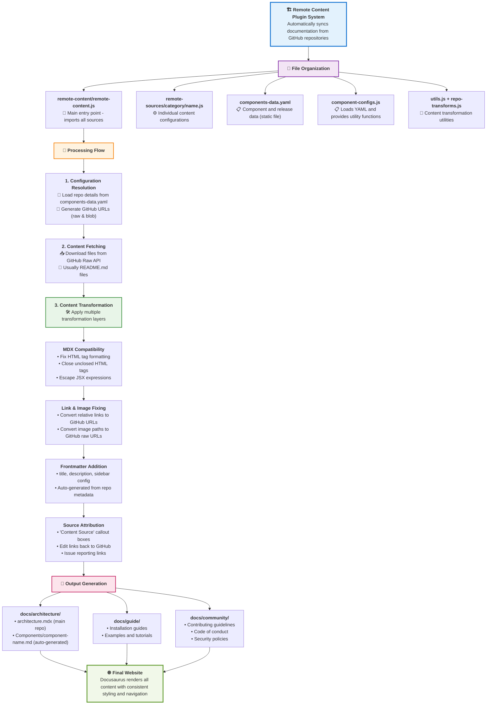

# Remote Content System

Automatically download and sync content from remote repositories (like GitHub) into your Docusaurus site. Each remote file gets its own configuration with automatic source attribution and edit links.

## 🎯 Features

- **Automatic Content Syncing** - Downloads content from remote repositories during build
- **Source Attribution** - Adds "Content Source" banners with edit links (now at bottom of pages)
- **Component Auto-Generation** - Automatically creates documentation for all components
- **Link Transformation** - Fixes relative links to work in the documentation site
- **Repository Transforms** - Handles different repository structures and conventions

## 🚀 Quick Start

### Cutting a New Release for the Documentation Site

**When a new llm-d release is published, follow these steps to update the documentation:**

**Step 1: Update the YAML file (one-time manual step)**
```bash
cd remote-content/remote-sources
node sync-release.mjs              # Fetches latest release from GitHub API
                                   # Updates components-data.yaml file
git diff components-data.yaml      # Review the changes
```

**Step 2: Commit the updated YAML**
```bash
git add components-data.yaml
git commit -m "Update to llm-d vX.Y.Z"
```

**Step 3: Build and deploy**
```bash
cd ../..                           # Back to root
npm run build                      # Build reads from the committed YAML file
npm run serve                      # Test locally (optional)
git push                           # Deploy (triggers CI build)
```

**What happens:**
- ✅ `sync-release.mjs` queries GitHub API and updates `components-data.yaml` (manual, one-time)
- ✅ `components-data.yaml` is committed to the repo
- ✅ Build process reads from the static YAML file (no API calls during build)
- ✅ Guides are fetched from the release tag specified in the YAML

**Important:** The YAML file is a static, committed file. The build process never modifies it - only the `sync-release.mjs` script does.

[Jump to detailed release management instructions →](#-managing-releases-and-components)

---

### Adding New Content

#### 1. Choose Directory & Copy Template

Files are organized by their destination in the docs:

| Directory | Purpose | Final Location |
|-----------|---------|----------------|
| `architecture/` | Architecture docs | `docs/architecture/` |
| `guide/` | User guides & installation | `docs/guide/` |
| `community/` | Community resources | `docs/community/` |

```bash
# Choose the appropriate directory for your content
cp remote-content/remote-sources/example-readme.js.template remote-content/remote-sources/DIRECTORY/my-content.js

# Examples:
cp remote-content/remote-sources/example-readme.js.template remote-content/remote-sources/guide/my-guide.js
cp remote-content/remote-sources/example-readme.js.template remote-content/remote-sources/architecture/my-component.js
```

#### 2. Edit Configuration

Update the copied file and replace these placeholders:

| Placeholder | Example | Description |
|-------------|---------|-------------|
| `YOUR-REPO-NAME` | `llm-d-infra` | Repo name from component-configs.js |
| `your-content-name` | `user-guide` | Unique name for CLI commands |
| `docs/YOUR-SECTION` | `docs/guide` | Where to put the file |
| `your-file.md` | `guide.md` | Output filename |

#### 3. Add to System
```javascript
// remote-content/remote-content.js
import myContent from './remote-sources/DIRECTORY/my-content.js';

const remoteContentPlugins = [
  contributeSource,
  codeOfConductSource,
  myContent,  // Add here
];
```

#### 4. Test
```bash
npm start
```

## 🏗️ Architecture

### System Overview



### Detailed Processing Flow

Here's how a single content source gets transformed from GitHub into your documentation:

```mermaid
graph TD
    A["`**GitHub Repository**
    e.g., llm-d/llm-d-inference-scheduler`"] --> B["`**Source Configuration**
    e.g., architecture/component.js`"]
    
    B --> C["`**Configuration Lookup**
    Load from components-data.yaml`"]
    
    C --> D["`**Repository Details**
    org: 'llm-d'<br/>
    name: 'llm-d-inference-scheduler'<br/>
    branch: 'main'<br/>
    description: 'vLLM-optimized...'`"]
    
    D --> E["`**URL Generation**
    generateRepoUrls()`"]
    
    E --> F["`**Generated URLs**
    repoUrl: github.com/llm-d/llm-d-inference-scheduler<br/>
    sourceBaseUrl: raw.githubusercontent.com/.../main/`"]
    
    F --> G["`**Content Fetch**
    Download README.md from sourceBaseUrl`"]
    
    G --> H["`**Raw Content**
    Original markdown from repository`"]
    
    H --> I["`**Transform Pipeline**
    modifyContent() function`"]
    
    I --> I1["`**Step 1: MDX Fixes**
    repo-transforms.js<br/>
    • Fix HTML tag formatting<br/>
    • Fix unclosed HTML tags<br/>
    • Escape JSX expressions`"]
    
    I1 --> I2["`**Step 2: Image Resolution**
    repo-transforms.js<br/>
    • Markdown images to GitHub raw URLs<br/>
    • HTML img tags to GitHub raw URLs`"]
    
    I2 --> I3["`**Step 3: Link Resolution**
    repo-transforms.js<br/>
    • Relative links to GitHub blob URLs<br/>
    • Reference links to GitHub blob URLs`"]
    
    I3 --> I4["`**Step 4: Content Wrapping**
    utils.js - createContentWithSource()<br/>
    • Generate frontmatter<br/>
    • Add source attribution callout`"]
    
    I4 --> J["`**Transformed Content**
    ---<br/>
    title: Inference Scheduler<br/>
    description: vLLM-optimized...<br/>
    sidebar_label: Inference Scheduler<br/>
    sidebar_position: 1<br/>
    ---<br/><br/>
    TRANSFORMED CONTENT<br/><br/>
    :::info Content Source<br/>
    This content is automatically synced...<br/>
    :::`"]
    
    J --> K["`**File Output**
    docs/architecture/Components/inference-scheduler.md`"]
    
    K --> L["`**Docusaurus Processing**
    Renders as website page`"]
    
    style A fill:#e3f2fd
    style D fill:#f3e5f5
    style H fill:#fff3e0
    style I1 fill:#e8f5e8
    style I2 fill:#e8f5e8
    style I3 fill:#e8f5e8
    style I4 fill:#e8f5e8
    style J fill:#fce4ec
    style K fill:#f1f8e9
    style L fill:#e1f5fe
```



### Technical Architecture

```mermaid
graph TB
    subgraph DOCUSAURUS["**Docusaurus Integration**"]
        DC["`**docusaurus.config.js**
        plugins: ...remoteContentPlugins`"]
    end
    
    subgraph MAIN["**Main Entry Point**"]
        RC["`**remote-content.js**
        • Imports all source configs<br/>
        • Exports plugin array<br/>
        • Central orchestration`"]
    end
    
    subgraph CONFIG["**Configuration Layer**"]
        YML["`**components-data.yaml**
        • Component definitions<br/>
        • Release information<br/>
        • Single source of truth`"]
        
        CC["`**component-configs.js**
        • Loads YAML data<br/>
        • COMMON_REPO_CONFIGS<br/>
        • findRepoConfig()<br/>
        • generateRepoUrls()`"]
        
        RT["`**repo-transforms.js**
        • applyBasicMdxFixes()<br/>
        • fixImages()<br/>
        • transformRepo()<br/>
        • getRepoTransform()`"]
        
        UT["`**utils.js**
        • createStandardTransform()<br/>
        • createSourceCallout()<br/>
        • createContentWithSource()`"]
    end
    
    subgraph SOURCES["**Content Source Configurations**"]
        subgraph ARCH["**Architecture Sources**"]
            AM["`**architecture-main.js**
            Main repo README to architecture.mdx`"]
            CG["`**components-generator.js**
            Auto-generates component docs`"]
        end
        
        subgraph GUIDE["**Guide Sources**"]
            GE["`**guide-examples.js**
            Examples landing page`"]
            GP["`**guide-prerequisites.js**
            Installation prerequisites`"]
            GI["`**guide-inference-scheduling.js**
            Inference scheduling guide`"]
            GW["`**guide-wide-ep-lws.js**
            Wide endpoint guide`"]
            GD["`**guide-pd-disaggregation.js**
            PD disaggregation guide`"]
        end
        
        subgraph COMM["**Community Sources**"]
            CO["`**contribute.js**
            Contributing guidelines`"]
            CC2["`**code-of-conduct.js**
            Code of conduct`"]
            SE["`**security.js**
            Security policy`"]
            SI["`**sigs.js**
            Special interest groups`"]
        end
    end
    
    subgraph OUTPUT["**Generated Documentation**"]
        subgraph DOCS_ARCH["**docs/architecture/**"]
            DA1["`**architecture.mdx**
            Main architecture doc`"]
            DA2["`**Components/**
            Auto-generated component docs`"]
        end
        
        subgraph DOCS_GUIDE["**docs/guide/**"]
            DG1["`**Installation/**
            Installation guides`"]
            DG2["`**examples.md**
            Examples page`"]
        end
        
        subgraph DOCS_COMM["**docs/community/**"]
            DC1["`**contribute.md**
            Contributing guide`"]
            DC2["`**code-of-conduct.md**
            Code of conduct`"]
            DC3["`**security.md**
            Security policy`"]
            DC4["`**sigs.md**
            SIG information`"]
        end
    end
    
    %% Main connections
    DC --> RC
    RC --> AM
    RC --> CG
    RC --> GE
    RC --> GP
    RC --> GI
    RC --> GW
    RC --> GD
    RC --> CO
    RC --> CC2
    RC --> SE
    RC --> SI
    
    %% Config dependencies
    CC --> YML
    AM --> CC
    AM --> UT
    AM --> RT
    CG --> CC
    CG --> UT
    CG --> RT
    
    %% Similar pattern for guides and community
    GE --> CC
    GE --> UT
    GE --> RT
    GP --> CC
    GP --> UT
    GP --> RT
    
    CO --> CC
    CO --> UT
    CO --> RT
    
    %% Output generation
    AM --> DA1
    CG --> DA2
    GE --> DG2
    GP --> DG1
    GI --> DG1
    GW --> DG1
    GD --> DG1
    CO --> DC1
    CC2 --> DC2
    SE --> DC3
    SI --> DC4
    
    %% Styling
    style DOCUSAURUS fill:#e1f5fe,stroke:#01579b,stroke-width:2px
    style MAIN fill:#f3e5f5,stroke:#4a148c,stroke-width:2px
    style CONFIG fill:#fff3e0,stroke:#e65100,stroke-width:2px
    style SOURCES fill:#e8f5e8,stroke:#1b5e20,stroke-width:2px
    style OUTPUT fill:#fce4ec,stroke:#880e4f,stroke-width:2px
```



### Component Auto-Generation

The system automatically generates documentation for all components defined in `components-data.yaml`. This includes:
- Loading component configurations from the static YAML file
- Fetching README files from component repositories
- Adding consistent frontmatter and navigation
- Applying repository-specific transformations
- Creating source attribution banners
- Generating a components overview page with latest release information


### Repository Transforms

Different repositories may have different link structures or conventions. The `repo-transforms.js` file handles:
- Fixing relative links to point to the correct repositories
- Adjusting image paths
- Handling repository-specific markdown formats

#### Link Transformation Behavior

The system automatically transforms relative links in markdown files to ensure they work correctly in the documentation site:

**Relative Links → GitHub URLs**
- Links without `./` prefix (e.g., `[file.md](file.md)` or `[PR_SIGNOFF.md](PR_SIGNOFF.md)`)
- Links with `./` prefix (e.g., `[file.md](./file.md)`)
- Links with `../` navigation (e.g., `[file.md](../../other/file.md)`)
- All are transformed to absolute GitHub URLs: `https://github.com/org/repo/blob/main/path/file.md`

**Internal Guide Links → Local Docs**
- Specific guide files listed in `INTERNAL_GUIDE_MAPPINGS` (in `repo-transforms.js`)
- These stay within the docs site for better navigation
- Example: `guides/QUICKSTART.md` → `/docs/guide/Installation/quickstart`

**Images → GitHub Raw URLs**
- All relative image paths are converted to GitHub raw URLs
- Example: `` → ``

**Using `createStandardTransform()`**

All content sources should use `createStandardTransform()` to get consistent link handling:

```javascript
const contentTransform = createStandardTransform('llm-d');

// Then pass it to createContentWithSource:
createContentWithSource({
  // ... other options
  contentTransform  // Apply standard transformations
})
```

For special cases where you need to override specific links after transformation:

```javascript
const contentTransform = (content, sourcePath) => {
  const standardTransform = createStandardTransform('llm-d');
  const transformed = standardTransform(content, sourcePath);
  
  // Override specific GitHub links to stay local
  return transformed
    .replace(/\(https:\/\/github\.com\/llm-d\/llm-d\/blob\/main\/CODE_OF_CONDUCT\.md\)/g, '(code-of-conduct)')
    .replace(/\(https:\/\/github\.com\/llm-d\/llm-d\/blob\/main\/SIGS\.md\)/g, '(sigs)');
};
```

## 📁 File Structure

```
remote-content/
├── remote-content.js                    # Main system (imports all sources)
├── remote-sources/
│   ├── components-data.yaml            # 🎯 Component and release data (EDIT THIS!)
│   ├── sync-release.mjs                # 🚀 Automated release sync script
│   ├── architecture/                   # → docs/architecture/
│   │   ├── architecture-main.js        # Main architecture documentation
│   │   └── components-generator.js     # Auto-generates component documentation
│   ├── guide/                          # → docs/guide/ & docs/guide/Installation/
│   │   └── guide-generator.js          # Auto-generates all guide pages (synced from release version)
│   ├── community/                      # → docs/community/
│   │   ├── code-of-conduct.js         # Code of conduct
│   │   ├── contribute.js              # Contributing guide
│   │   ├── security.js                # Security policy
│   │   └── sigs.js                    # Special Interest Groups
│   ├── utils.js                        # Shared utilities (used by all)
│   ├── repo-transforms.js              # Repository-specific transformations
│   ├── component-configs.js            # Loads and exports data from components-data.yaml
│   └── example-readme.js.template     # Template for new sources
└── README.md                          # This file
```

### Directory Organization

The remote-sources directory is organized to mirror the final documentation structure:

- **`architecture/`** - Files that generate content for `docs/architecture/`
- **`guide/`** - Files that generate content for `docs/guide/` and `docs/guide/Installation/`
- **`community/`** - Files that generate content for `docs/community/`
- **Root level** - Shared utilities and configurations used across all directories

## 🔧 Managing Releases and Components

### 🚀 Cutting a Release for the Documentation Site

When a new llm-d release is published, update the documentation using this workflow:

#### Step 1: Run the Sync Script (Manual, One-Time)

The `sync-release.mjs` script is a **one-time manual operation** that updates the static YAML file:

```bash
cd remote-content/remote-sources
node sync-release.mjs              # Updates components-data.yaml
```

**What this script does:**
- ✅ Queries [GitHub Releases API](https://github.com/llm-d/llm-d/releases/latest) for the latest release
- ✅ Updates the `release` section in `components-data.yaml` with version, date, and URL
- ✅ Extracts component descriptions from the release notes (from `## 🔹` sections)
- ✅ Updates matching component descriptions in the YAML file
- ✅ Preserves your existing categories, sidebar positions, and other metadata
- ✅ **Writes changes to `components-data.yaml`** (which you then commit)

**Preview changes before writing:**
```bash
node sync-release.mjs --dry-run    # Preview what would change
```

#### Step 2: Review and Commit the YAML

```bash
git diff components-data.yaml      # Review the changes
git add components-data.yaml
git commit -m "Update to llm-d vX.Y.Z"
```

#### Step 3: Build and Deploy

```bash
cd ../..                           # Back to repo root
npm run build                      # Build reads from components-data.yaml
npm run serve                      # Test locally (optional)
git push                           # Deploy (triggers CI/CD)
```

**Important:** 
- 🔒 **The YAML file is static and committed to the repo**
- 🚫 **The build process NEVER modifies the YAML** - it only reads from it
- 🔄 **Only `sync-release.mjs` updates the YAML** - and only when you run it manually
- 🏗️ **CI/CD builds have zero external dependencies** - they just read the committed YAML file

### Manual Release Updates

If you prefer to update manually or need to make custom changes:

**Edit `remote-sources/components-data.yaml`:**
```yaml
release:
  version: v0.4.0
  releaseDate: 2025-01-15
  releaseDateFormatted: January 15, 2025
  releaseUrl: https://github.com/llm-d/llm-d/releases/tag/v0.4.0
  releaseName: llm-d v0.4.0
```

### Adding New Components

To add a new component to the documentation:

1. **Edit `remote-sources/components-data.yaml`**:
   ```yaml
   components:
     # ... existing components
     - name: llm-d-your-component
       org: llm-d
       branch: main
       description: Description of your component
       category: Core Infrastructure
       sidebarPosition: 8
   ```

2. **Component will auto-appear** in the next build under `/docs/architecture/Components/`

### Important: Guide Versioning

**Guides are synced from the release version**, not from `main`:
- When you update the `release.version` in the YAML, guides will automatically be fetched from that release tag
- This ensures documentation matches the released version
- Example: With `version: v0.3.0`, guides come from the `v0.3.0` tag, not `main` branch

To update guides to a new release, just update the release version and rebuild.

### Adding Other Content

For non-component content:

1. **Choose the right directory**:
   - `architecture/` for architecture documentation
   - `guide/` for user guides and installation docs
   - `community/` for community resources

2. **Copy and customize template**:
   ```bash
   cp remote-content/remote-sources/example-readme.js.template remote-content/remote-sources/DIRECTORY/your-content.js
   ```

3. **Update imports in remote-content.js** to include your new file

## 🐛 Troubleshooting

| Problem | Fix |
|---------|-----|
| Page not appearing | Check source URL is publicly accessible |
| Build errors | Verify all `YOUR-...` placeholders are replaced |
| Wrong sidebar order | Check `sidebarPosition` numbers |
| Links broken | Ensure you're using `createStandardTransform()` - it automatically fixes relative links to GitHub URLs |
| Relative links not working | All relative links (with or without `./`) are automatically converted to GitHub URLs by `createStandardTransform()` |
| Import errors | Ensure file is imported in `remote-content/remote-content.js` with correct path |
| Component not showing | Check `components-data.yaml` and ensure repository is public |
| Source banner missing | Verify you're using `createContentWithSource()` from utils.js |
| Banner at wrong location | Source banners now appear at bottom of pages automatically |
| Import path errors | Use `../` to reference utils from subdirectories (e.g., `../utils.js`) |
| File in wrong directory | Move to appropriate subdirectory: `architecture/`, `guide/`, or `community/` |
| Template not working | Ensure you're using the updated template with correct import paths |
| Need local links | Override specific links after `createStandardTransform()` - see "Using `createStandardTransform()`" section above |

## 📝 Content Source Banners

All synced content automatically includes a "Content Source" banner at the **bottom** of the page with:
- Link to the original source file
- Edit link for contributors
- Link to file issues

This helps users understand where content comes from and how to contribute changes. 