# Remote Content System

Automatically download and sync content from remote repositories (like GitHub) into your Docusaurus site. Each remote file gets its own configuration with automatic source attribution and edit links.

## 🎯 Features

- **Automatic Content Syncing** - Downloads content from remote repositories during build
- **Source Attribution** - Adds "Content Source" banners with edit links (now at bottom of pages)
- **Component Auto-Generation** - Automatically creates documentation for all components
- **Link Transformation** - Fixes relative links to work in the documentation site
- **Repository Transforms** - Handles different repository structures and conventions

## 🚀 Quick Start

### 1. Choose Directory & Copy Template

Files are organized by their destination in the docs:

| Directory | Purpose | Final Location |
|-----------|---------|----------------|
| `architecture/` | Architecture docs | `docs/architecture/` |
| `guide/` | User guides & installation | `docs/guide/` |
| `community/` | Community resources | `docs/community/` |

```bash
# Choose the appropriate directory for your content
cp remote-content/remote-sources/example-readme.js.template remote-content/remote-sources/DIRECTORY/my-content.js

# Examples:
cp remote-content/remote-sources/example-readme.js.template remote-content/remote-sources/guide/my-guide.js
cp remote-content/remote-sources/example-readme.js.template remote-content/remote-sources/architecture/my-component.js
```

### 2. Edit Configuration

Update the copied file and replace these placeholders:

| Placeholder | Example | Description |
|-------------|---------|-------------|
| `YOUR-REPO-NAME` | `llm-d-infra` | Repo name from component-configs.js |
| `your-content-name` | `user-guide` | Unique name for CLI commands |
| `docs/YOUR-SECTION` | `docs/guide` | Where to put the file |
| `your-file.md` | `guide.md` | Output filename |

### 3. Add to System
```javascript
// remote-content/remote-content.js
import myContent from './remote-sources/DIRECTORY/my-content.js';

const remoteContentPlugins = [
  contributeSource,
  codeOfConductSource,
  myContent,  // Add here
];
```

### 4. Test
```bash
npm start
```

## 🏗️ Architecture

### System Overview

```mermaid
flowchart TD
    A["`**🏗️ Remote Content Plugin System**
    Automatically syncs documentation from GitHub repositories`"] --> B["`**📁 File Organization**`"]
    
    B --> B1["`**remote-content/remote-content.js**
    🎯 Main entry point - imports all sources`"]
    B --> B2["`**remote-sources/category/name.js**
    ⚙️ Individual content configurations`"]
    B --> B3["`**component-configs.js**
    📋 Central repository definitions`"]
    B --> B4["`**utils.js + repo-transforms.js**
    🔧 Content transformation utilities`"]
    
    B1 --> C["`**🔄 Processing Flow**`"]
    
    C --> C1["`**1. Configuration Resolution**
    📝 Find repo details from component-configs.js
    🔗 Generate GitHub URLs (raw & blob)`"]
    
    C1 --> C2["`**2. Content Fetching**
    📥 Download files from GitHub Raw API
    📄 Usually README.md files`"]
    
    C2 --> C3["`**3. Content Transformation**
    🛠️ Apply multiple transformation layers`"]
    
    C3 --> C3a["`**MDX Compatibility**
    • Fix HTML tag formatting
    • Close unclosed HTML tags
    • Escape JSX expressions`"]
    
    C3a --> C3b["`**Link & Image Fixing**
    • Convert relative links to GitHub URLs
    • Convert image paths to GitHub raw URLs`"]
    
    C3b --> C3c["`**Frontmatter Addition**
    • title, description, sidebar config
    • Auto-generated from repo metadata`"]
    
    C3c --> C3d["`**Source Attribution**
    • 'Content Source' callout boxes
    • Edit links back to GitHub
    • Issue reporting links`"]
    
    C3d --> D["`**📄 Output Generation**`"]
    
    D --> D1["`**docs/architecture/**
    • architecture.mdx (main repo)
    • Components/component-name.md (auto-generated)`"]
    
    D --> D2["`**docs/guide/**
    • Installation guides
    • Examples and tutorials`"]
    
    D --> D3["`**docs/community/**
    • Contributing guidelines
    • Code of conduct
    • Security policies`"]
    
    D1 --> E["`**🌐 Final Website**
    Docusaurus renders all content with consistent styling and navigation`"]
    D2 --> E
    D3 --> E
    
    style A fill:#e3f2fd,stroke:#1976d2,stroke-width:3px
    style B fill:#f3e5f5,stroke:#7b1fa2,stroke-width:2px
    style C fill:#fff3e0,stroke:#f57c00,stroke-width:2px
    style C3 fill:#e8f5e8,stroke:#388e3c,stroke-width:2px
    style D fill:#fce4ec,stroke:#c2185b,stroke-width:2px
    style E fill:#f1f8e9,stroke:#689f38,stroke-width:3px
```



### Detailed Processing Flow

Here's how a single content source gets transformed from GitHub into your documentation:

```mermaid
graph TD
    A["`**GitHub Repository**
    e.g., llm-d/llm-d-inference-scheduler`"] --> B["`**Source Configuration**
    e.g., architecture/component.js`"]
    
    B --> C["`**Configuration Lookup**
    component-configs.js`"]
    
    C --> D["`**Repository Details**
    org: 'llm-d'<br/>
    name: 'llm-d-inference-scheduler'<br/>
    branch: 'main'<br/>
    description: 'vLLM-optimized...'`"]
    
    D --> E["`**URL Generation**
    generateRepoUrls()`"]
    
    E --> F["`**Generated URLs**
    repoUrl: github.com/llm-d/llm-d-inference-scheduler<br/>
    sourceBaseUrl: raw.githubusercontent.com/.../main/`"]
    
    F --> G["`**Content Fetch**
    Download README.md from sourceBaseUrl`"]
    
    G --> H["`**Raw Content**
    Original markdown from repository`"]
    
    H --> I["`**Transform Pipeline**
    modifyContent() function`"]
    
    I --> I1["`**Step 1: MDX Fixes**
    repo-transforms.js<br/>
    • Fix HTML tag formatting<br/>
    • Fix unclosed HTML tags<br/>
    • Escape JSX expressions`"]
    
    I1 --> I2["`**Step 2: Image Resolution**
    repo-transforms.js<br/>
    • Markdown images to GitHub raw URLs<br/>
    • HTML img tags to GitHub raw URLs`"]
    
    I2 --> I3["`**Step 3: Link Resolution**
    repo-transforms.js<br/>
    • Relative links to GitHub blob URLs<br/>
    • Reference links to GitHub blob URLs`"]
    
    I3 --> I4["`**Step 4: Content Wrapping**
    utils.js - createContentWithSource()<br/>
    • Generate frontmatter<br/>
    • Add source attribution callout`"]
    
    I4 --> J["`**Transformed Content**
    ---<br/>
    title: Inference Scheduler<br/>
    description: vLLM-optimized...<br/>
    sidebar_label: Inference Scheduler<br/>
    sidebar_position: 1<br/>
    ---<br/><br/>
    TRANSFORMED CONTENT<br/><br/>
    :::info Content Source<br/>
    This content is automatically synced...<br/>
    :::`"]
    
    J --> K["`**File Output**
    docs/architecture/Components/inference-scheduler.md`"]
    
    K --> L["`**Docusaurus Processing**
    Renders as website page`"]
    
    style A fill:#e3f2fd
    style D fill:#f3e5f5
    style H fill:#fff3e0
    style I1 fill:#e8f5e8
    style I2 fill:#e8f5e8
    style I3 fill:#e8f5e8
    style I4 fill:#e8f5e8
    style J fill:#fce4ec
    style K fill:#f1f8e9
    style L fill:#e1f5fe
```



### Technical Architecture

```mermaid
graph TB
    subgraph DOCUSAURUS["**Docusaurus Integration**"]
        DC["`**docusaurus.config.js**
        plugins: ...remoteContentPlugins`"]
    end
    
    subgraph MAIN["**Main Entry Point**"]
        RC["`**remote-content.js**
        • Imports all source configs<br/>
        • Exports plugin array<br/>
        • Central orchestration`"]
    end
    
    subgraph CONFIG["**Configuration Layer**"]
        CC["`**component-configs.js**
        • COMPONENT_CONFIGS array<br/>
        • COMMON_REPO_CONFIGS<br/>
        • findRepoConfig()<br/>
        • generateRepoUrls()`"]
        
        RT["`**repo-transforms.js**
        • applyBasicMdxFixes()<br/>
        • fixImages()<br/>
        • transformRepo()<br/>
        • getRepoTransform()`"]
        
        UT["`**utils.js**
        • createStandardTransform()<br/>
        • createSourceCallout()<br/>
        • createContentWithSource()`"]
    end
    
    subgraph SOURCES["**Content Source Configurations**"]
        subgraph ARCH["**Architecture Sources**"]
            AM["`**architecture-main.js**
            Main repo README to architecture.mdx`"]
            CG["`**components-generator.js**
            Auto-generates component docs`"]
        end
        
        subgraph GUIDE["**Guide Sources**"]
            GE["`**guide-examples.js**
            Examples landing page`"]
            GP["`**guide-prerequisites.js**
            Installation prerequisites`"]
            GI["`**guide-inference-scheduling.js**
            Inference scheduling guide`"]
            GW["`**guide-wide-ep-lws.js**
            Wide endpoint guide`"]
            GD["`**guide-pd-disaggregation.js**
            PD disaggregation guide`"]
        end
        
        subgraph COMM["**Community Sources**"]
            CO["`**contribute.js**
            Contributing guidelines`"]
            CC2["`**code-of-conduct.js**
            Code of conduct`"]
            SE["`**security.js**
            Security policy`"]
            SI["`**sigs.js**
            Special interest groups`"]
        end
    end
    
    subgraph OUTPUT["**Generated Documentation**"]
        subgraph DOCS_ARCH["**docs/architecture/**"]
            DA1["`**architecture.mdx**
            Main architecture doc`"]
            DA2["`**Components/**
            Auto-generated component docs`"]
        end
        
        subgraph DOCS_GUIDE["**docs/guide/**"]
            DG1["`**Installation/**
            Installation guides`"]
            DG2["`**examples.md**
            Examples page`"]
        end
        
        subgraph DOCS_COMM["**docs/community/**"]
            DC1["`**contribute.md**
            Contributing guide`"]
            DC2["`**code-of-conduct.md**
            Code of conduct`"]
            DC3["`**security.md**
            Security policy`"]
            DC4["`**sigs.md**
            SIG information`"]
        end
    end
    
    %% Main connections
    DC --> RC
    RC --> AM
    RC --> CG
    RC --> GE
    RC --> GP
    RC --> GI
    RC --> GW
    RC --> GD
    RC --> CO
    RC --> CC2
    RC --> SE
    RC --> SI
    
    %% Config dependencies
    AM --> CC
    AM --> UT
    AM --> RT
    CG --> CC
    CG --> UT
    CG --> RT
    
    %% Similar pattern for guides and community
    GE --> CC
    GE --> UT
    GE --> RT
    GP --> CC
    GP --> UT
    GP --> RT
    
    CO --> CC
    CO --> UT
    CO --> RT
    
    %% Output generation
    AM --> DA1
    CG --> DA2
    GE --> DG2
    GP --> DG1
    GI --> DG1
    GW --> DG1
    GD --> DG1
    CO --> DC1
    CC2 --> DC2
    SE --> DC3
    SI --> DC4
    
    %% Styling
    style DOCUSAURUS fill:#e1f5fe,stroke:#01579b,stroke-width:2px
    style MAIN fill:#f3e5f5,stroke:#4a148c,stroke-width:2px
    style CONFIG fill:#fff3e0,stroke:#e65100,stroke-width:2px
    style SOURCES fill:#e8f5e8,stroke:#1b5e20,stroke-width:2px
    style OUTPUT fill:#fce4ec,stroke:#880e4f,stroke-width:2px
```



### Component Auto-Generation

The system automatically generates documentation for all components listed in `component-configs.js`. This includes:
- Fetching README files from component repositories
- Adding consistent frontmatter and navigation
- Applying repository-specific transformations
- Creating source attribution banners

### Repository Transforms

Different repositories may have different link structures or conventions. The `repo-transforms.js` file handles:
- Fixing relative links to point to the correct repositories
- Adjusting image paths
- Handling repository-specific markdown formats

#### Link Transformation Behavior

The system automatically transforms relative links in markdown files to ensure they work correctly in the documentation site:

**Relative Links → GitHub URLs**
- Links without `./` prefix (e.g., `[file.md](file.md)` or `[PR_SIGNOFF.md](PR_SIGNOFF.md)`)
- Links with `./` prefix (e.g., `[file.md](./file.md)`)
- Links with `../` navigation (e.g., `[file.md](../../other/file.md)`)
- All are transformed to absolute GitHub URLs: `https://github.com/org/repo/blob/main/path/file.md`

**Internal Guide Links → Local Docs**
- Specific guide files listed in `INTERNAL_GUIDE_MAPPINGS` (in `repo-transforms.js`)
- These stay within the docs site for better navigation
- Example: `guides/QUICKSTART.md` → `/docs/guide/Installation/quickstart`

**Images → GitHub Raw URLs**
- All relative image paths are converted to GitHub raw URLs
- Example: `` → ``

**Using `createStandardTransform()`**

All content sources should use `createStandardTransform()` to get consistent link handling:

```javascript
const contentTransform = createStandardTransform('llm-d');

// Then pass it to createContentWithSource:
createContentWithSource({
  // ... other options
  contentTransform  // Apply standard transformations
})
```

For special cases where you need to override specific links after transformation:

```javascript
const contentTransform = (content, sourcePath) => {
  const standardTransform = createStandardTransform('llm-d');
  const transformed = standardTransform(content, sourcePath);
  
  // Override specific GitHub links to stay local
  return transformed
    .replace(/\(https:\/\/github\.com\/llm-d\/llm-d\/blob\/main\/CODE_OF_CONDUCT\.md\)/g, '(code-of-conduct)')
    .replace(/\(https:\/\/github\.com\/llm-d\/llm-d\/blob\/main\/SIGS\.md\)/g, '(sigs)');
};
```

## 📁 File Structure

```
remote-content/
├── remote-content.js                    # Main system (imports all sources)
├── remote-sources/
│   ├── architecture/                   # → docs/architecture/
│   │   ├── architecture-main.js        # Main architecture documentation
│   │   └── components-generator.js     # Auto-generates component documentation
│   ├── guide/                          # → docs/guide/ & docs/guide/Installation/
│   │   ├── guide-examples.js           # User guide landing page
│   │   ├── guide-inference-scheduling.js # Installation guide sections
│   │   ├── guide-pd-disaggregation.js  # Installation guide sections
│   │   ├── guide-prerequisites.js      # Installation guide sections
│   │   └── guide-wide-ep-lws.js        # Installation guide sections
│   ├── community/                      # → docs/community/
│   │   ├── code-of-conduct.js         # Code of conduct
│   │   ├── contribute.js              # Contributing guide
│   │   ├── security.js                # Security policy
│   │   └── sigs.js                    # Special Interest Groups
│   ├── utils.js                        # Shared utilities (used by all)
│   ├── repo-transforms.js              # Repository-specific transformations
│   ├── component-configs.js            # Component repository configurations
│   └── example-readme.js.template     # Template for new sources
└── README.md                          # This file
```

### Directory Organization

The remote-sources directory is organized to mirror the final documentation structure:

- **`architecture/`** - Files that generate content for `docs/architecture/`
- **`guide/`** - Files that generate content for `docs/guide/` and `docs/guide/Installation/`
- **`community/`** - Files that generate content for `docs/community/`
- **Root level** - Shared utilities and configurations used across all directories

## 🔧 Adding New Content

### Adding Components

Components are automatically generated from `component-configs.js`. To add a new component:

1. **Add to component-configs.js**:
   ```javascript
   export const COMPONENT_CONFIGS = [
     // ... existing components
     {
       name: 'your-component-name',
       org: 'llm-d',  // or other org
       branch: 'main', // or 'dev'
       description: 'Description of your component',
       sidebarPosition: 10 // adjust as needed
     }
   ];
   ```

2. **Component will auto-appear** in the next build under `/docs/architecture/Components/`

### Adding Other Content

For non-component content:

1. **Choose the right directory**:
   - `architecture/` for architecture documentation
   - `guide/` for user guides and installation docs
   - `community/` for community resources

2. **Copy and customize template**:
   ```bash
   cp remote-content/remote-sources/example-readme.js.template remote-content/remote-sources/DIRECTORY/your-content.js
   ```

3. **Update imports in remote-content.js** to include your new file

## 🐛 Troubleshooting

| Problem | Fix |
|---------|-----|
| Page not appearing | Check source URL is publicly accessible |
| Build errors | Verify all `YOUR-...` placeholders are replaced |
| Wrong sidebar order | Check `sidebarPosition` numbers |
| Links broken | Ensure you're using `createStandardTransform()` - it automatically fixes relative links to GitHub URLs |
| Relative links not working | All relative links (with or without `./`) are automatically converted to GitHub URLs by `createStandardTransform()` |
| Import errors | Ensure file is imported in `remote-content/remote-content.js` with correct path |
| Component not showing | Check `component-configs.js` and ensure repository is public |
| Source banner missing | Verify you're using `createContentWithSource()` from utils.js |
| Banner at wrong location | Source banners now appear at bottom of pages automatically |
| Import path errors | Use `../` to reference utils from subdirectories (e.g., `../utils.js`) |
| File in wrong directory | Move to appropriate subdirectory: `architecture/`, `guide/`, or `community/` |
| Template not working | Ensure you're using the updated template with correct import paths |
| Need local links | Override specific links after `createStandardTransform()` - see "Using `createStandardTransform()`" section above |

## 📝 Content Source Banners

All synced content automatically includes a "Content Source" banner at the **bottom** of the page with:
- Link to the original source file
- Edit link for contributors
- Link to file issues

This helps users understand where content comes from and how to contribute changes. 